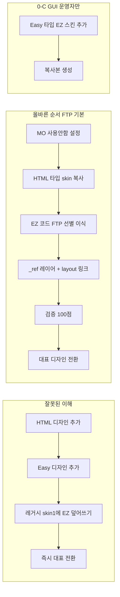

# 워크플로우 07 — 레거시 스마트디자인 + EZ 엎어쓰기 (초기 세팅 핑퐁)

> **대상:** 레거시 스마트디자인(HTML) 스킨이 오래됐거나 유지보수가 어려울 때, **EZ skin16(또는 최신 EZ base)** 를 골격으로 두고 커스텀 레이어(`_ref*/`, `_nk/`)만 올려 레퍼런스·시안을 구현하는 접근.  
> **선행:** `/접속세팅` 완료. 레퍼런스가 있으면 `/레퍼런스인입` 후 진행.  
> **실증 몰:** [`00_시작하기/예시-데모몰.md`](../../00_시작하기/예시-데모몰.md) — ecudemo400786 (`editor_type=HTML`, EZ skin16 FTP 오버레이 on `/sde_design/base` + `_ref393674`)

---

## 🎯 사용 시점

✅ 레거시 HTML 스킨이 구식·손상·모듈 불일치  
✅ EZ 반응형 base가 필요하고, 전면 HTML 재작성은 부담  
✅ 파트너/에이전트가 **FTP 커스텀 레이어** 패턴으로 작업 중

❌ 관리자 EZ 섹션 편집만으로 충분한 소규모 변경 — `01-quick-fix`  
❌ 레거시 위에 또 레거시를 덧씌우는 **부분 오버레이만** 하고 EZ base 정리를 안 하는 경우 — 이 워크플로우 **금지**

---

## ⚠️ 판정 요약 (읽고 진입)

| OK | 하면 안 됨 |
|----|-----------|
| **FTP 주력** → HTML 타입 skin 복사본 + EZ **코드** 선별 이식 + `_ref*/` 레이어 | Easy 타입 대표 + FTP/HTML 대량 수정 (**F35** GUI 충돌) |
| EZ **전체 base** 확정 + `_ref*/` 레이어만 편집 | 레거시 layout/module을 EZ에 **파일 단위 부분 덮어쓰기**만 하고 `#contents`·MO·paginate 미검증 |
| Phase 0 `#contents`·MO 설정 **100점 전** 페이지 작업 | `MOBILE_WEB=true` + base만 배포 |
| base + mobile 동기화 또는 MO 전용 OFF | skin1(원본) 직접 수정 · preference INI FTP 이전 가정 |

상세 비판·근거: 본 문서 말미 **「판정 근거」** · [`02_막혔을때/common-pitfalls.md`](../../02_막혔을때/common-pitfalls.md)

---

## Phase 0 — 몰 상태 진단 (코드 금지 · 질문 핑퐁)

**목표:** FTP·관리자·라이브 소스를 맞춰 「지금 무엇이 서빙되는지」 확정.

### 0-A. 에이전트 체크리스트 (MCP·FTP·라이브)

| 항목 | 확인 방법 | 기록 |
|------|-----------|------|
| FTP 루트 구조 | `nlst` — `/sde_design/{base,mobile}` vs `/skinN` | |
| 대표 디자인 skin 코드 | 관리자 디자인 보관함 또는 `cafe24_list_themes` | |
| `editor_type` | API: **H**=스마트디자인(HTML) · **E**=스마트디자인Easy | |
| 라이브 layout | `layout/basic/layout.html` — EZ `data-ez-*` 유무, `#container>#contents` | |
| `CAFE24.MOBILE_WEB` | 페이지 소스 검색 `MOBILE_WEB` | false 권장 |
| 모바일 트리 | `/sde_design/mobile/` 존재·`layout.html`에 커스텀 CSS 링크 | |

**파트너 몰 경로 규칙:** 일반몰 `/skin16` 루트 vs 파트너 `/sde_design/base` — [`brain/_evidence/partner-live-ecudemo400786-2026-06-19.txt`](../../brain/_evidence/partner-live-ecudemo400786-2026-06-19.txt)

### 0-B. 사용자 핑퐁 (복붙)

```
[Phase 0 진단]
1. 관리자 → 디자인 → 디자인 보관함: PC/MO **대표 디자인 이름**과 skin 번호가 뭔가요?
2. 쇼핑몰 설정 → 모바일 → 「모바일 전용 디자인 사용설정」이 **사용**인가요 **사용안함**인가요?
   (반응형 EZ 작업 시 사용안함 필요 — https://support.cafe24.com/hc/ko/articles/8466336842009)
3. 작업 범위: 메인만 / 메인+PLP+PDP / 전 페이지 타입?
4. 레퍼런스 URL (있다면):
```

**게이트:** 0-A 표 채움 + 사용자 1~3 답변 → Phase 1 진입. MO 설정 미확인 시 Phase 4 금지.

### 0-C. 관리자에서 디자인 추가 — HTML vs Easy 선택 (순서 오해 방지)

> **⚠️ GUI 운영자 전용 — FTP/에이전트는 [Phase 0-D](#0-d-easy-타입-vs-html-타입--ftp-작업자-선택-f35)만**  
> 파트너·에이전트·FTP 주력 작업은 Easy 타입 추가(아래 3~4단계)를 **읽지 말고** 0-D(HTML 복사 + EZ FTP overlay)로 바로 이동하세요.

> **핵심:** 관리자 「디자인 추가」 화면의 두 선택지(스마트디자인 HTML · 스마트디자인Easy)는 **새 디자인 1개를 추가할 때 그 디자인의 타입**이다.  
> **「HTML 먼저 추가 → Easy 나중」 같은 2단계 순서가 아니다.**

| 구분 | 스마트디자인 (HTML) | 스마트디자인Easy |
|------|---------------------|------------------|
| 표시 | 별도 표시 없음 | `Easy`, `반응형` 뱃지 |
| FTP | `/skinN/` (일반몰) | `/sde_design/base/` (파트너몰 등) |
| 상속 | **상속 가능** (원본 수정 시 전파) | **상속 불가** ([디자인 보관함](https://support.cafe24.com/hc/ko/articles/7740573969945)) |
| ez-on-legacy | **FTP 주력** — HTML 복사본 + EZ **코드** 선별 이식 (`_ref*/`) · 레거시 **비대표 유지** | **GUI 운영자 전용** — Easy 타입 fresh 추가 후 섹션 편집 · FTP 대량 수정 **금지** (**F35**) |

**레거시 HTML 몰 → EZ 전환 권장 순서 (관리자만, FTP 전):**

1. **진단** — [디자인 > 디자인 보관함](https://eclogin.cafe24.com/Shop/?onnode=1&menu=1562&mode=pro) PC 탭에서 현재 **대표 디자인** 이름·타입(HTML/Easy) 확인. 레거시 HTML은 당장 건드리지 않음.
2. **모바일 설정 (EZ 반응형 전제)** — [쇼핑몰 설정 > 사이트 설정 > 쇼핑몰 환경 설정 > 모바일 > 기본설정 > 사용설정](https://support.cafe24.com/hc/ko/articles/8466336842009) 에서 **「모바일 전용 디자인 사용설정」→ 사용안함** 저장. (반응형 EZ 대표 적용 시 필수 — [EZ 시작하기 Info](https://support.cafe24.com/hc/ko/articles/7749162976281))
3. **EZ 디자인 추가 (HTML 선행 불필요)** — 디자인 보관함 PC 탭 → **「기본 디자인 추가」** → 목록에서 **Easy·반응형** 표시 스킨 선택 (무료 5종: 오우이·아키테이블·커먼셀렉트·애쉬프레임·캠퍼타운 — [EZ 시작하기](https://support.cafe24.com/hc/ko/articles/7749162976281)) → **「추가」**. 또는 Easy 편집기 **디자인 라이브러리**에서 동일 5종 추가 가능.
4. **작업용 복사본 생성** — 추가된 EZ 디자인 선택 → **「복사」**(권장) → 이름 예: `EZ-work-202606`. **「상속」은 EZ 미지원·부모 변경 전파 위험** — ez-on-legacy에서는 **복사만** ([복사/상속](https://support.cafe24.com/hc/ko/articles/7740575780249)).
5. **대표 디자인은 아직 유지** — 복사 skin에서 검증·FTP `_ref*/` 작업 완료 전까지 **레거시 HTML을 대표로 두거나**, EZ 복사본을 비대표 테스트 skin으로 둠. 라이브 전환은 Phase 4 게이트 통과 후 ([대표 디자인 설정](https://support.cafe24.com/hc/ko/articles/7740574991641)).
6. **FTP 게이트 확인** — 복사 skin의 FTP 경로(`/skin16` 또는 `/sde_design/base`)·`layout.html`에 `data-ez-*`·`#container>#contents` 존재 확인 후 Phase 2 진입.

**하지 말 것:** 레거시 HTML skin1에 EZ layout 부분 덮어쓰기 · HTML 타입으로 EZ 추가 후 Easy로 「변환」 기대 · 상속 skin에서 `_ref*/` 작업.

#### 잘못된 순서 vs 올바른 순서



| 단계 | ❌ 잘못된 순서 | ✅ 올바른 순서 (FTP·에이전트) | ✅ GUI 운영자 (0-C만) |
|------|---------------|------------------------------|----------------------|
| 타입 선택 | HTML 추가 후 Easy 추가 (2단계) | **HTML 타입** skin 복사 — Easy 타입 **추가 안 함** | **한 번에 Easy 타입** 스킨 추가 |
| EZ base | Easy 타입 등록 후 FTP layout 수정 | EZ **코드** FTP 선별 이식 (`skin16` 등) | 관리자 디자인 라이브러리에서 EZ 추가 |
| 레거시 | skin1/layout에 EZ 파일 덮어쓰기 | 레거시 **비대표·참고용** 유지 | 동일 |
| 작업 skin | 원본·상속 skin | **HTML 복사본** + `_ref*/` | **Easy 복사본** |
| 대표 | EZ 추가 직후 전환 | **검증 후** 전환 | **검증 후** 전환 |
| MO | 사용함 + EZ 반응형 혼용 | **사용안함** (단일 반응형 PC skin) | 동일 |

**공식 근거:** [디자인 보관함](https://support.cafe24.com/hc/ko/articles/7740573969945) · [디자인 추가/구매](https://support.cafe24.com/hc/ko/articles/7749114519321) · [EZ 시작하기](https://support.cafe24.com/hc/ko/articles/7749162976281) · [반응형 적용 FAQ](https://support.cafe24.com/hc/ko/articles/8466336842009)

### 0-D. Easy 타입 vs HTML 타입 — FTP 작업자 선택 (**F35**)

> **사용자 우려가 맞음:** Easy 타입은 **섹션 GUI가 기본**이고, HTML/FTP로 구조를 바꾼 뒤 Easy로 돌아오면 **초기화·편집 오류** 가능 ([HTML 수정 FAQ](https://support.cafe24.com/hc/ko/articles/9131045034777)). GUI 끄기·HTML-only 모드 **없음**.

| 작업 방식 | 관리자에 추가할 타입 | 비고 |
|-----------|---------------------|------|
| **FTP·에이전트·파트너 대량 HTML** (본 키트 기본) | **스마트디자인(HTML)** — 레거시 skin **복사본** | EZ **코드**(`layout`, `_ref*/`, `data-ez-*` 선별)만 FTP 이식. Easy 타입 **추가하지 않음** |
| 쇼핑몰 운영자 GUI만 | **스마트디자인Easy** | HTML/FTP 최소. 파트너 EZ-on-legacy와 **다른 층** |

**FTP 주력 권장 순서 (0-C의 Easy 추가 경로 대신):**

1. MO **사용안함** (0-C 2단계와 동일)
2. 디자인 보관함 → **레거시 HTML skin 복사** (또는 빈 HTML 디자인) → 작업 skin 확보
3. EZ 소스(skin16·아키테이블 등)에서 **필요 파일만** FTP — `_ref*/`, layout 링크, css/js. **Easy 타입으로 디자인 추가하지 않음**
4. 검증 100점 후 대표 전환

**Easy 타입을 쓰는 경우 (0-C 3~4단계):** 운영자가 섹션 GUI로만 유지보수할 때만. FTP로 layout·list.html을 고치면 **F35** 충돌.

**참조 구현 (HTML+EZ FTP):** ecudemo400786 — 관리자 HTML 타입 유지, EZ skin16을 `/sde_design/base/`에 FTP 오버레이, `_ref393674/`만 편집. Easy 타입 미등록. → [`00_시작하기/예시-데모몰.md`](../../00_시작하기/예시-데모몰.md)

상세: [`02_막혔을때/common-pitfalls.md`](../../02_막혔을때/common-pitfalls.md) §F35 · [Easy 초기화 오류](https://support.cafe24.com/hc/ko/articles/9131043889945)

**EZ 선별 이식·걷어내기:** brain §6 F36 · [`WORK-GUIDE.md`](../../brain/docs/WORK-GUIDE.md) §15 (`strip_ez.py`) · STEP 2 strip_ez in [`CAFE24-SMARTDESIGN-AGENT.md`](../../brain/docs/CAFE24-SMARTDESIGN-AGENT.md)

---

## Phase 1 — EZ base 결정 (복사 vs 선택적 교체)

### Decision tree

```
레거시 대표 스킨이 EZ(editor_type=E)인가?
├─ YES → 관리자 「디자인 복사」로 작업용 skin 생성 (원본 보호)
│         └─ skin16/최신 EZ가 아니면 → EZ 소스(skin16·타 몰 FTP)에서 **코드만** 선별 이식 검토
└─ NO (순수 HTML H) →
    ├─ [권장 A · FTP·에이전트] HTML 타입 skin **복사** → EZ **코드** FTP 선별 이식 + `_ref*/` 레이어
    │            (Phase 0-D — Easy 타입 **추가하지 않음** · ecudemo400786 패턴)
    ├─ [차선 B] FTP로 타 몰 EZ base 통째 다운로드 → HTML 복사 skin에 업로드
    │            (유의: preference INI 미이전 — https://support.cafe24.com/hc/ko/articles/8466116839833)
    └─ [GUI 전용 C] 관리자 Easy 타입 EZ **신규 추가** → 복사본에서 섹션 편집 (0-C · FTP 대량 수정 금지 F35)
```

| 전략 | 속도 | 리스크 |
|------|------|--------|
| **A. HTML 복사 + EZ FTP overlay** | 중 | **낮음** — 키트·파트너 **기본** (0-D, `08` Phase A→B) |
| **B. FTP 통째 이전** | 빠름 | 높음 — 설정·INI·저작권 |
| **C. layout.html만 교체** | 매우 빠름 | **최고** — module·CSS·MO 불일치 (ecudemo 버그 패턴) |
| **D. 레거시 파일만 EZ에 부분 덮기** | 빠름 | **금지에 가까움** — dual CSS·마크업 충돌 |
| **E. Easy 타입 fresh + GUI** | 중 | **F35** — FTP·에이전트와 **다른 층** (0-C GUI 전용) |

**권장 (FTP·에이전트):** **A** 또는 B 후 **대표는 아직 바꾸지 않음** — 복사 skin에서 검증 완료 후 전환 ([디자인 복사](https://support.cafe24.com/hc/ko/articles/7740575780249)). GUI만 쓸 때만 **E**(0-C).

### 1-B. 사용자 핑퐁

```
[Phase 1 base 결정]
진단 결과 editor_type={H|E}, FTP={/sde_design/base|/skinN} 입니다.
제안: {A|B} — {이유 한 줄}
동의하시면 「예」. 다른 몰 EZ를 가져올 FTP 소스가 있으면 mall_id 알려주세요.
```

---

## Phase 2 — 커스텀 레이어 (`_ref*/` / `_nk/`) — skin1 금지

**목표:** EZ 코어(`layout/`, `css/ec-base-*`, module HTML)는 **읽기 전용**. 변경은 전용 폴더만.

### 디렉터리 규칙

```
/sde_design/base/
  layout/basic/layout.html     ← link/@import만 추가 (body 끝 우선)
  _ref393674/                  ← 또는 _nk/
    css/base.css               ← #container #contents 첫 블록 필수
    css/sub.css                ← 페이지 타입별
    css/sub-paginate.css       ← body 끝, add_layout 직후
    js/layout.js               ← detectSubPageType()
    inc/                       ← 섹션 조각 (선택)
```

| ✅ | ❌ |
|----|-----|
| `layout.html`에 `@css(/_ref393674/css/...)` 추가 | `skin1`·원본 `layout.css` 직접 수정 |
| 복사 skin에서 작업 | 상속(inherit) skin에 작업 — 부모 변경 전파 ([상속 주의](https://support.cafe24.com/hc/ko/articles/7740575780249)) |
| 버전 쿼리 `?v=N` on custom only | EZ core `@css`에 `?v=` (F3) |

### 2-B. layout.html 최소 링크 순서 (EZ)

```
head:  EZ core css (건드리지 않음)
       → _ref*/base.css (맨 앞 블록 = #contents override)
body:  @contents
       → sub_style / sub_theme / add_layout (EZ 기본)
       → _ref*/sub-paginate.css  ← paginate는 반드시 body 끝
```

### 에이전트 핑퐁

```
[Phase 2 레이어]
_ref393674 폴더 생성 완료. layout.html에 링크 3곳 추가 예정:
- head: base.css
- body 끝: sub-paginate.css
skin1·ec-base-* 원본은 수정하지 않습니다. 업로드 전 diff 보여드릴까요? 「예」/「아니오」
```

---

## Phase 3 — Pre-flight (`#contents` · paginate · mobile)

**페이지 작업 전 필수.** [`06-verify-loop.md`](06-verify-loop.md) Phase 0 · 0.5와 동일.

### 3-A. `#contents` 92% trap

- 규칙: [`brain/rules/ez-contents-width.md`](../../brain/rules/ez-contents-width.md)
- 스니펫: [`brain/docs/snippets/ez-contents-override.css`](../../brain/docs/snippets/ez-contents-override.css)
- F코드: **F8** wrap overflow, **#contents** → `02_막혔을때/F-상황-인덱스.md` 검색

**390px PASS:** `#contents`.width ≈ viewport (±4px). FAIL ≈ 359 (92%).

### 3-B. 페이지 타입 표 (인입 연동)

[`05-reference-intake.md`](05-reference-intake.md) 타입표 — **PLP ≠ narrow** 먼저 확정.

| 타입 | body class 예 | container |
|------|---------------|-----------|
| hero-main | `ref*-main` | 100% |
| plp-full | `ref*-sub-plp` | 100% + padding |
| pdp-full | `ref*-sub-pdp` | 100% |
| narrow | `ref*-sub-narrow` | max 1200px |

### 3-C. Paginate 전역

- 한 파일: `sub-paginate.css` @ body 끝 — [`brain/docs/snippets/ec-paginate-override.css`](../../brain/docs/snippets/ec-paginate-override.css)
- 함정: [`02_막혔을때/common-pitfalls.md`](../../02_막혔을때/common-pitfalls.md) §전역 페이징

### 3-D. Mobile

- [`brain/rules/responsive-mobile.md`](../../brain/rules/responsive-mobile.md)
- 관리자 MO 전용 **사용안함** 사용자 확인
- 배포: `base` + `mobile` 동기화 또는 base `@media` only

### 3-E. 핑퐁 (Pre-flight 결과)

```
[Phase 3 Pre-flight]
- C1 #contents @390: {PASS|FAIL} (width={N}px)
- MOBILE_WEB: {true|false}
- paginate spot-check: {PASS|FAIL}
- 페이지 타입표: {첨부/링크}

{FAIL 항목} 있으면 Phase 4 진입 금지. 수정 후 재측정합니다.
```

---

## Phase 4 — Verify 100 후 페이지 작업

1. `python work/scripts/ref393674-score-mobile-full.py` → **C1 = 100**
2. [`06-verify-loop.md`](06-verify-loop.md) Phase 1~6 순서
3. 이후 [`03-reference-renewal.md`](03-reference-renewal.md) 또는 [`02-skin-build-standard.md`](02-skin-build-standard.md) ④ 생성

**게이트:** `total_score = 100` only. 100 미만이면 해당 Phase만 수정·재업로드.

### 대표 디자인 전환 (최종)

```
[대표 전환 전 체크]
- PC 1440 + MO 390 score 100 (해당 Phase)
- 옵션·장바구니·결제 1회 수동 확인
- 백업 skin 이름: ______

「대표로 바꿔도 됩니다」 확인 후 관리자에서 대표 디자인 설정.
```

---

## 프롬프트 템플릿 (에이전트 ↔ 사용자)

### 진입

```
/카페24-워크플로우
워크플로우: ez-on-legacy-setup
몰ID: {mall_id}
레퍼런스: {url 또는 없음}
```

### Phase 0 한 방

```
ez-on-legacy-setup Phase 0만 실행해줘.
FTP·editor_type·MOBILE_WEB·대표 skin 진단표 채우고,
관리자에서 확인할 질문 3개만 보내줘. 코드 수정 금지.
```

### 레이어 세팅

```
Phase 2 실행: EZ base는 건드리지 말고 _ref{id}/ 만 만들어.
layout.html 링크 추가안 diff 보여주고, 업로드는 내 「예」 후에.
#contents override는 brain/rules/ez-contents-width.md 첫 블록으로.
```

### 막혔을 때

```
ecudemo400786 postmortem 기준으로 진단해줘.
common-pitfalls.md에서 #contents / paginate / mobile / PLP narrow 중 뭐에 해당하는지 매핑하고,
수정 파일 경로만 제안 (한 번에 1 Phase).
```

---

## 관련 워크플로우

| 문서 | 조건 |
|------|------|
| [`08-ez-three-step-pingpong`](08-ez-three-step-pingpong.md) | **압축 핑퐁** — HTML→EZ overlay→strip 스킵/선별만 빠르게 돌릴 때 |
| `05-reference-intake` | 레퍼런스 URL·시안 있음 |
| `06-verify-loop` | Phase 3 PASS 후 |
| `03-reference-renewal` | 1:1 구현 |
| `02-skin-build-standard` | EZ 잔재 클리닝 후 대규모 빌드 |

---

## 판정 근거 (요약)

**찬성 근거 (공식·실무)**  
- EZ는 스마트디자인과 **동일 구조**, HTML 편집·모듈 동일 ([EZ 시작하기](https://support.cafe24.com/hc/ko/articles/7749162976281), [스마트디자인 편집](https://support.cafe24.com/hc/ko/articles/7749165125401))  
- 디자인 **복사 후 테스트** 권장 ([복사/상속](https://support.cafe24.com/hc/ko/articles/7740575780249))  
- 개발자센터: layout + `@contents` + module 패턴 ([Theme fundamentals](https://developers.cafe24.com/design/front/smart/sdsupport/basic))

**반대 근거 (키트 postmortem)**  
- `#contents` 92%, dual CSS, paginate 로드 순서, MO 스킨 분리, module 마크업 불일치 — [`02_막혔을때/common-pitfalls.md`](../../02_막혔을때/common-pitfalls.md)

**파트너 공개 자료 한계**  
- 디자인센터는 「단순복사·맞춤제작」 옵션만 공개 ([d.cafe24.com](https://d.cafe24.com/designer/designer_view?agencyId=esujinn)) — 「레거시 위 EZ 오버레이」 절차는 **미공개**

---

## 진입 명령

```
/카페24-워크플로우 시작
워크플로우: ez-on-legacy-setup
```

또는:

```
레거시 스킨 몰에 EZ skin16 base 깔고 _ref 레이어 세팅.
07-ez-on-legacy-setup Phase 0부터 핑퐁.
```
