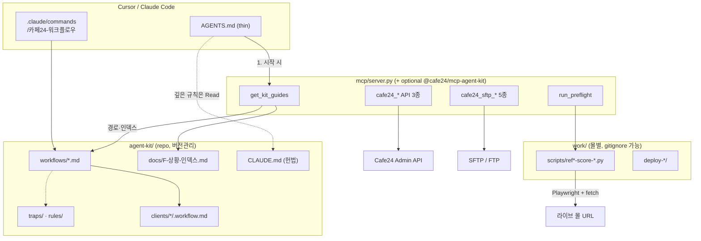

# Cafe24 하이브리드 아키텍처 초안

> Sixshop-style (thin AGENTS + MCP bootstrap) + Cafe24 agent-kit (workflows, traps, verify-loop)  
> 작성: 2026-06-19 · 구현 전 설계 문서

**현재 파일럿 몰:** `ecudemo400786` — 수용 기준: [`TEMPLATE-PILOT-ACCEPTANCE.md`](TEMPLATE-PILOT-ACCEPTANCE.md)

---

## 1. 타당성 판정: **Partial (단계별 Yes)**

| 영역 | 판정 | 근거 |
|------|------|------|
| Phase 1 `get_kit_guides` | **Yes** | Sixshop `get_mcp_guides`와 동일 패턴. `agent-kit/` 경로·워크플로우·F-index JSON 반환만 하면 됨. |
| Phase 2 `run_preflight` | **Partial** | `ref393674-score-mobile-full.py` 등 이미 존재. **stub 구현됨** (2026-06-19): subprocess + JSON 파싱. Playwright·몰 URL·셀렉터는 **프로젝트/몰별** — 범용 엔진은 가능, 범용 PASS는 아님. |
| Phase 3 npm 패키지 | **Partial** | Python MCP(`server.py`)와 Node bootstrap 이중 스택 비용. Phase 1–2는 **기존 `mcp/server.py` 확장**이 더 빠름. |
| 워크플로우·함정을 npm에 통째 이전 | **Not yet** | Markdown·슬래시 명령·`.workflow.md` 상태는 **repo에 두는 것이 정답**. npm은 부트스트랩·실행기만. |

**솔직한 제약**

- 검증 스크립트는 ecudemo393674→400786 레퍼런스에 하드코딩됨 → 새 몰은 REF/TGT·셀렉터 교체 필요.
- `CAFE24.MOBILE_WEB`·관리자 설정(F34)은 MCP가 바꿀 수 없음 → preflight는 **탐지·중단·안내**만.
- Playwright + Chromium은 MCP 서버 환경에 별도 설치 필요 (`run_preflight` Phase 2 전제).
- Windows Git Bash `MSYS_NO_PATHCONV` 등 배포 함정은 문서(traps)에 남기고 npm에 넣지 않음.

---

## 2. 하이브리드 아키텍처



### 역할 분담

| 레이어 | 담당 | 이유 |
|--------|------|------|
| **Thin AGENTS.md** (루트) | MCP 이름, `get_kit_guides` 1줄, OAuth 힌트 | Sixshop처럼 IDE 자동 주입 최소화 |
| **MCP `get_kit_guides`** | kit 루트, 워크플로우 목록, F-index 요약, 다음 Read 경로 | 에이전트 부트스트랩 — 매번 CLAUDE.md 전체 주입 불필요 |
| **MCP `run_preflight`** | subprocess로 score 스크립트 실행, JSON 점수·FAIL 항목 | verify-loop Phase 0/0.5 자동화 |
| **MCP cafe24_* 8종** | 몰 손발 (기존 유지) | 인증·SFTP는 패키지와 분리 |
| **agent-kit/** | workflows, traps, rules, commands, F-index, snippets | 사람·에이전트가 함께 편집하는 **지식 베이스** |
| **work/scripts/** | 몰·레퍼런스별 Playwright 채점 | 범용 npm에 넣지 않음 — 템플릿만 키트에 |

---

## 3. 로드맵 (Phase 1 → 3)

### Phase 1 — `get_kit_guides` (MVP, **1–2일**)

**목표:** Sixshop `get_mcp_guides` 대응. 에이전트가 키트 구조를 MCP 한 번으로 탐색.

**구현 위치:** `mcp/server.py`에 도구 1개 추가 (npm 불필요).

**환경 변수**

- `CAFE24_KIT_ROOT` — `agent-kit/` 절대 경로 (미설정 시 `server.py` 기준 `../agent-kit` 추론)

**반환 JSON (예시)**

```json
{
  "kit_root": "/path/to/agent-kit",
  "constitution": "CLAUDE.md",
  "workflows": [
    {"id": "01-quick-fix", "path": "workflows/01-quick-fix.md", "steps": 3},
    {"id": "06-verify-loop", "path": "workflows/06-verify-loop.md", "steps": "loop"}
  ],
  "f_index": "docs/F-상황-인덱스.md",
  "f_quick": ["F27", "F28", "F33", "F34", "F35"],
  "commands": ".claude/commands/카페24-워크플로우.md",
  "next_read": ["workflows/README.md", "docs/F-상황-인덱스.md"]
}
```

**수용 기준**

- [ ] MCP `tools/list`에 `get_kit_guides` 노출
- [ ] `CAFE24_KIT_ROOT` 없어도 모노레포 기본 경로 동작
- [ ] 루트 `AGENTS.md` 5줄 이하 + `get_kit_guides` 안내

---

### Phase 2 — `run_preflight` (**2–4일**)

**목표:** verify-loop Phase 0 (`#contents` 92%) + Phase 0.5 (`MOBILE_WEB`) 자동 채점.

**파라미터 (안)**

| 이름 | 설명 |
|------|------|
| `check` | `contents_width` \| `mobile_web` \| `mobile_full` \| `phase_plp` … |
| `target_base` | `https://{mall}.cafe24.com` |
| `ref_base` | (선택) 레퍼런스 몰 |
| `script_path` | (선택) `work/scripts/...` 오버라이드 |

**동작**

1. `contents_width` / `mobile_web`: 경량 — `urllib` fetch + regex (`score-mobile-full.py`의 `fetch_mobile_web` 패턴) 또는 Playwright 390×844 한 페이지.
2. `mobile_full` / `phase_*`: `subprocess`로 기존 `work/scripts/ref393674-score-*.py` 실행 → stdout JSON 파싱.
3. 반환: `{ "total_score", "pass": score==100, "checks": [...], "f_codes": ["F27"] }`

**수용 기준**

- [x] MCP `tools/list`에 `run_preflight` 노출 (stub)
- [x] ecudemo400786에 대해 `mobile_full` → 기존 CLI와 동일 점수 (100, C1 PASS — 2026-06-19 closeout)
- [ ] `MOBILE_WEB=true` 시 `pass:false` + F34 안내 문구
- [x] Playwright 미설치 시 명확한 `error` 필드
- [x] `header` check → CLI와 동일 점수 (100, 2026-06-19)

---

### Phase 3 — npm vs `server.py` (**선택, 3–5일**)

| 옵션 | 장점 | 단점 |
|------|------|------|
| **A. `server.py`만 확장** (권장) | Python 백엔드·OAuth·SFTP 일원화, 즉시 배포 | Node LSP/validation 없음 |
| **B. `@cafe24/mcp-agent-kit` npm** | Sixshop parity (bootstrap CLI, MCP 등록 헬퍼) | Py+Node 이중 유지보수 |
| **C. 하이브리드** | npm은 `npx @cafe24/mcp-agent-kit init` → `.cursor/mcp.json` + `CAFE24_KIT_ROOT`만 | 초기 복잡도 |

**권장:** Phase 1–2는 **A**. npm은 외부 팀에 키트만 배포할 때 **B/C** 검토.

---

## 4. npm에 넣지 말 것

| 항목 | 이유 |
|------|------|
| `mcp/config/*token*.json`, SFTP 비밀 | 보안·몰별 |
| `write_allowed` 화이트리스트 | 몰·스킨별 정책 |
| 레퍼런스 URL (ecudemo393674 등) | 프로젝트별 |
| 관리자 설정 경로·F34 안내 본문 | 카페24 UI 변경 시 repo MD만 수정 |
| `clients/{mall}/.workflow.md` | 작업 상태·PII |
| `work/scripts/ref393674-score-*.py` 전체 | 셀렉터·URL 하드코딩 — **템플릿**만 키트에 |
| `CLAUDE.md` / workflows 전문 | 버전은 git이 진실 공급원 |
| OAuth client_id/secret | 환경별 |

npm에 넣을 수 있는 것: `get_kit_guides` 스키마, preflight **러너** 골격, MCP 등록 스니펫, Playwright 의존성 체크.

---

## 5. 공수 추정

| Phase | 공수 | 산출물 |
|-------|------|--------|
| 1 | **1–2일** | `get_kit_guides`, thin `AGENTS.md`, smoke_test 1케이스 |
| 2 | **2–4일** | `run_preflight`, 2–3 check 타입, F-code 매핑 |
| 3 | **3–5일** (선택) | npm init CLI 또는 문서화만 |

**총 MVP (Phase 1+2): 약 3–6일** (1인, 기존 스크립트 재사용 전제).

---

## 6. `get_kit_guides` 도구 디스크립터 (샘플)

### MCP tool JSON

```json
{
  "name": "get_kit_guides",
  "description": "카페24 agent-kit 워크플로우·F-index·다음에 읽을 문서 경로를 반환합니다. 작업 시작 시 가장 먼저 호출하세요.",
  "arguments": {
    "type": "object",
    "properties": {
      "workflow_id": {
        "type": "string",
        "description": "선택: 01-quick-fix, 06-verify-loop 등. 생략 시 README+전체 목록."
      },
      "symptom_f_code": {
        "type": "string",
        "description": "선택: F27, F28 등 증상 코드 — F-index에서 관련 문서만 필터."
      }
    }
  }
}
```

### Python pseudo-code (`mcp/server.py`)

```python
import os
from pathlib import Path

KIT_ROOT = Path(os.environ.get("CAFE24_KIT_ROOT", Path(__file__).resolve().parent.parent / "agent-kit"))

WORKFLOWS = [
    ("01-quick-fix", 3),
    ("02-skin-build-standard", 6),
    ("03-reference-renewal", 8),
    ("04-measure-first", None),
    ("05-reference-intake", 5),
    ("06-verify-loop", None),
    ("07-ez-on-legacy-setup", None),
    ("08-ez-three-step-pingpong", 3),
]

@mcp.tool(name="get_kit_guides", ...)
def get_kit_guides(
    workflow_id: str | None = None,
    symptom_f_code: str | None = None,
) -> str:
    if not KIT_ROOT.is_dir():
        return _json({"error": "CAFE24_KIT_ROOT not found", "hint": "set env or clone agent-kit"})

    out = {
        "kit_root": str(KIT_ROOT),
        "constitution": str(KIT_ROOT / "CLAUDE.md"),
        "f_index": str(KIT_ROOT / "docs/F-상황-인덱스.md"),
        "workflows_readme": str(KIT_ROOT / "workflows/README.md"),
        "workflows": [
            {"id": wid, "path": str(KIT_ROOT / "workflows" / f"{wid}.md"), "steps": steps}
            for wid, steps in WORKFLOWS
        ],
        "slash_command": str(KIT_ROOT / ".claude/commands/카페24-워크플로우.md"),
        "next_read": [str(KIT_ROOT / "workflows/README.md"), str(KIT_ROOT / "docs/F-상황-인덱스.md")],
    }
    if workflow_id:
        p = KIT_ROOT / "workflows" / f"{workflow_id}.md"
        out["focused_workflow"] = str(p) if p.exists() else None
    if symptom_f_code:
        out["f_code_hint"] = f"Read F-index section {symptom_f_code} in docs/F-상황-인덱스.md"
    return _json(out)
```

---

## 7. Thin AGENTS.md (루트 초안)

```markdown
# 에이전트 가이드

- 카페24 스킨 작업 시 `cafe24_mcp`의 **`get_kit_guides`** 를 먼저 호출해 워크플로·F-index 경로를 확인하세요.
- 몰 접속·업로드는 기존 `cafe24_*` MCP 도구를 사용합니다. 업로드 전 사용자 확인 필수.
- 깊은 규칙·함정은 `get_kit_guides`가 가리키는 `agent-kit/CLAUDE.md` 및 workflows를 Read 하세요.
```

---

## 8. ADR 요약

| | |
|--|--|
| **Decision** | Phase 1–2는 `mcp/server.py` 확장; agent-kit는 repo에 유지 |
| **Drivers** | 기존 Python SFTP/API 일원화, ecudemo 검증 스크립트 재사용, Sixshop식 부트스트랩 |
| **Alternatives** | (1) agent-kit만 — MCP 없이 CLAUDE.md 주입 (이미 동작, bootstrap 약함) (2) 전면 npm — 이중 스택 |
| **Why chosen** | 최소 diff로 `get_mcp_guides` 패리티 + verify 자동화 |
| **Consequences** | `CAFE24_KIT_ROOT` 설정 필요; npm은 Phase 3 선택 |
| **Follow-ups** | score 스크립트 템플릿화, `page-type classifier` (kit-roadmap) |
