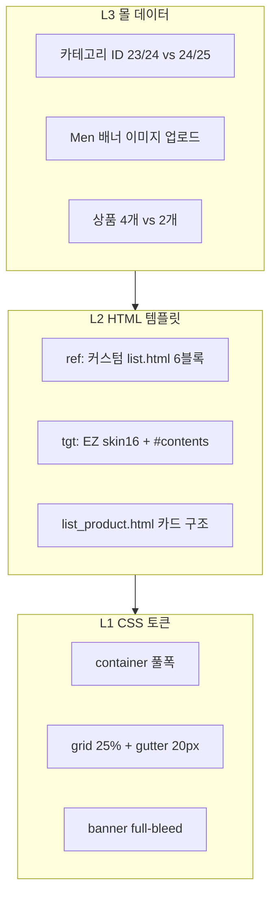

# ref PLP 분석 — Men cate_no=24

> URL: https://ecudemo393674.cafe24.com/product/list.html?cate_no=24  
> 실측: Playwright 1440×900 · 2026-06-19

---

## 한 줄 결론

**컨테이너 max-width만 맞춘다고 끝나는 페이지가 아닙니다.**  
레퍼런스는 **Adestudio/Morenvy 커스텀 `product/list.html`** 이고, 타겟은 **EZ skin16 list.html + CSS 덧씌우기** 상태입니다. DOM 구조·노출 블록·정렬 UI·카테고리 배너가 다릅니다.

---

## 1. DOM 구조 (가장 큰 격차)

| | 레퍼런스 | 타겟 (ec400786) |
|---|---|---|
| `#contents` | **없음** | **있음** (EZ 래퍼, 여백·1480px 간섭) |
| `#container` 자식 | **6개** 모듈이 직접 | **1개** (`#contents`만) |
| `list.html` 출처 | 커스텀 스킨 (xans-product-headcategory.banner 등) | EZ skin16 + ez-module 마크업 |

### 레퍼런스 `#container` 직계 자식 (위→아래)

| 순서 | 클래스/모듈 | display | 높이 | 역할 |
|---|---|---|---|---|
| 1 | `.xans-product-headcategory.path` | none | 0 | breadcrumb (숨김) |
| 2 | `.xans-product-headcategory.banner` | block | **457px** | **카테고리 상단 이미지** |
| 3 | `.xans-product-headcategory.title` | none | 0 | h2 "Men" (숨김) |
| 4 | `.xans-product-menupackage` | flex | 20px | **가로 카테고리 탭** (Men/Outerwear/Tops…) |
| 5 | `.xans-product-normalpackage` | block | 567px | count + sortby + prdList |
| 6 | `.xans-product-normalpaging` | none | 0 | 페이징 숨김 |

### 타겟 `#container` 안

- EZ `#contents` 한 덩어리
- `.section.titleArea` **109px 노출** (레퍼런스는 display:none)
- `.ec-base-tab.typeMenu` + `.menuCategory` — **CSS로 숨김** (레퍼런스는 **보이는 다른 구조**)
- `.product_top_image` — **높이 0, 이미지 없음** (레퍼런스 banner 457px)

---

## 2. 실측 격차표 (PC 1440px)

| # | 요소 | 레퍼런스 실측 | 타겟 실측 | 원인 |
|---|---|---|---|---|
| G1 | `.prdList` width | **1420px** (x=20) | **1298px** (x=76) | EZ `#contents`·`.titleArea` margin 56px + `.section` 패딩 |
| G2 | `.item` width (4열) | **355px** × 4 | ~325px급 (1~2개만) | G1 + `--prd-space-right` 10px vs ref 20px |
| G3 | 카테고리 배너 | **457px**, full-bleed img | **0px** (빈 블록) | ref: `headcategory.banner` + 업로드 이미지 / tgt: EZ `product_top_image` 비어 있음 |
| G4 | `.titleArea` | **display:none** | **109px** block | HTML·CSS 다른 템플릿 |
| G5 | 서브카테고리 | `.menupackage .menuCategory` **flex 노출** | `.ec-base-tab.typeMenu` **display:none** | 우리가 EZ 탭 숨김 + ref 구조 미구현 |
| G6 | 정렬 UI | `.count` "4 items" + `.sortby` **ul 링크** | `.function` "총 N개" + **select** | `list.html` 마크업 자체가 다름 |
| G7 | 상품 카드 | hover `.effect`, `.icon-wish`, `.icon-basket` | EZ 기본 카드 | `list_product.html` 구조 다름 |
| G8 | 폰트 | **Bricolage Grotesque** 13px | **Jost** 13px | tokens는 맞으나 EZ/테마 간섭 |
| G9 | container max-width | 100% (1440) | 100% (1440) | ✅ (layoutfix 후) |
| G10 | 상품 수 | Men cate24 **4개** | 해당 cate **2개** | **몰 데이터** (구조 문제 아님) |

---

## 3. 레퍼런스 CSS 핵심 (optimizer_user PLP 번들)

```css
.layout .a-container { display:flex; flex-direction:column; max-width:100%; }
.a-container { padding:50px 20px 100px; }

.xans-product-headcategory.banner { order:-2; }
.xans-product-headcategory.banner img {
  width: calc(100% + 40px);
  margin: 0 -20px;           /* 풀블리드 */
}
.xans-product-menupackage { display:flex; margin:0 0 12px; }
.menuCategory { display:flex; }
.prdList { display:flex; margin-right: calc(-1 * var(--prd-space-right)); }
.prdList[data-pc*="col4"] .item { width:25%; }
:root { --prd-space-right:20px; --prd-space-bottom:70px; } /* PC */

.sortby { position:relative; white-space:nowrap; }
.count { display:inline-block !important; margin-left:2px; }
```

타겟 `sub-product.css`는 `.menuCategory`, `.function`, `.titleArea` 등 **EZ 선택자만** 건드렸고,  
레퍼런스가 쓰는 **`.banner` / `.menupackage` / `.sortby`** 체계는 HTML이 없어 적용 불가.

---

## 4. “한 번에 왜 안 맞나” — 3가지 층



| 층 | CSS만으로 가능? | 이 페이지에서 |
|---|---|---|
| **L1** CSS | ⭕ | container 풀폭은 수정됨. grid·banner·sort는 HTML 없으면 불완전 |
| **L2** HTML | ❌ CSS만으로 불가 | **list.html을 ref 구조로 교체**해야 G3~G7 해결 |
| **L3** 데이터 | ❌ | 카테고리 배너·상품은 관리자/몰 설정 |

우리가 한 것: **L1 일부 + L2는 EZ HTML 그대로 + L3 무시** → 당연히 한 번에 안 맞음.

---

## 5. ref `list.html`에만 있는 것 (타겟에 없음)

- `xans-product-headcategory.banner` + 카테고리 대표 이미지 (`shop1_24_top_936808.jpg`)
- `xans-product-menupackage` + swiper 가로 메뉴
- `normalmenu` 안 `.count` + `.sortby` + `#type` ul (select 아님)
- `prdList` item 안 `.effect` hover, `.button` wish/cart
- `title` / `path` 모듈은 **있지만 CSS로 숨김** (EZ titleArea는 **보임**)

---

## 6. 올바른 작업 순서 (workflow 03)

1. **실측 시트** — 이 문서 (완료)
2. **`product/list.html` ref HTML 기준 재작성** — EZ section/titleArea/typeMenu 제거, ref 6블록 구조
3. **`product/list_product.html`** — hover·버튼 markup 맞춤
4. **`sub-product.css`** — ref optimizer CSS에서 PLP 규칙 이식 (banner, menupackage, sortby, col4)
5. **카테고리 배너** — tgt 몰 cate 24/25에 이미지 업로드 or ref CDN 임시
6. **업로드 → ?v=N → 재실측 PASS/FAIL**

---

## 7. 확인 URL

- 레퍼런스: https://ecudemo393674.cafe24.com/product/list.html?cate_no=24
- 타겟: https://ecudemo400786.cafe24.com/product/list.html?cate_no=24
